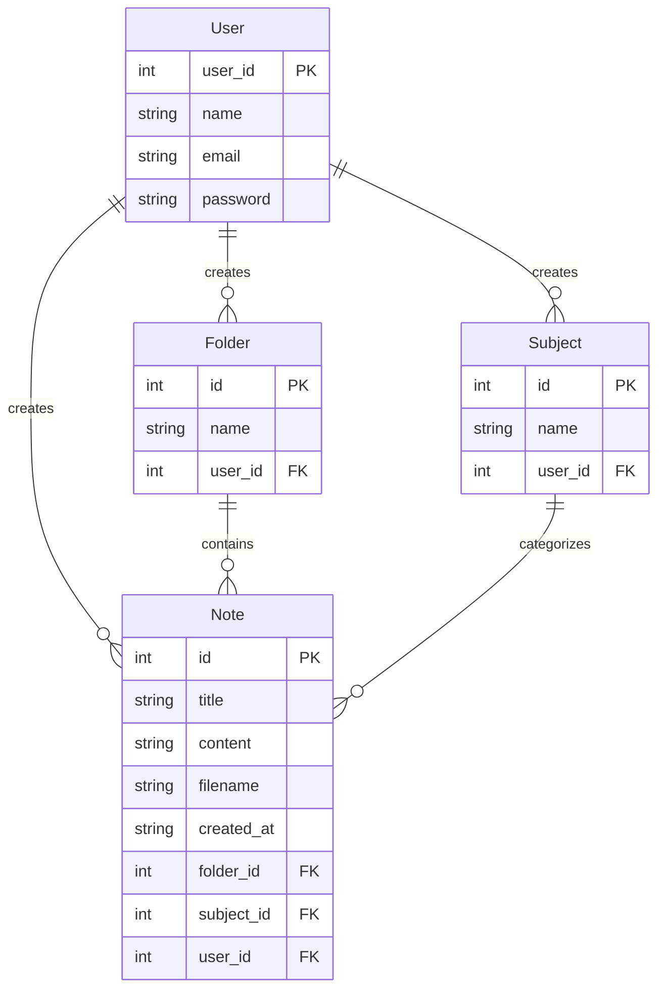
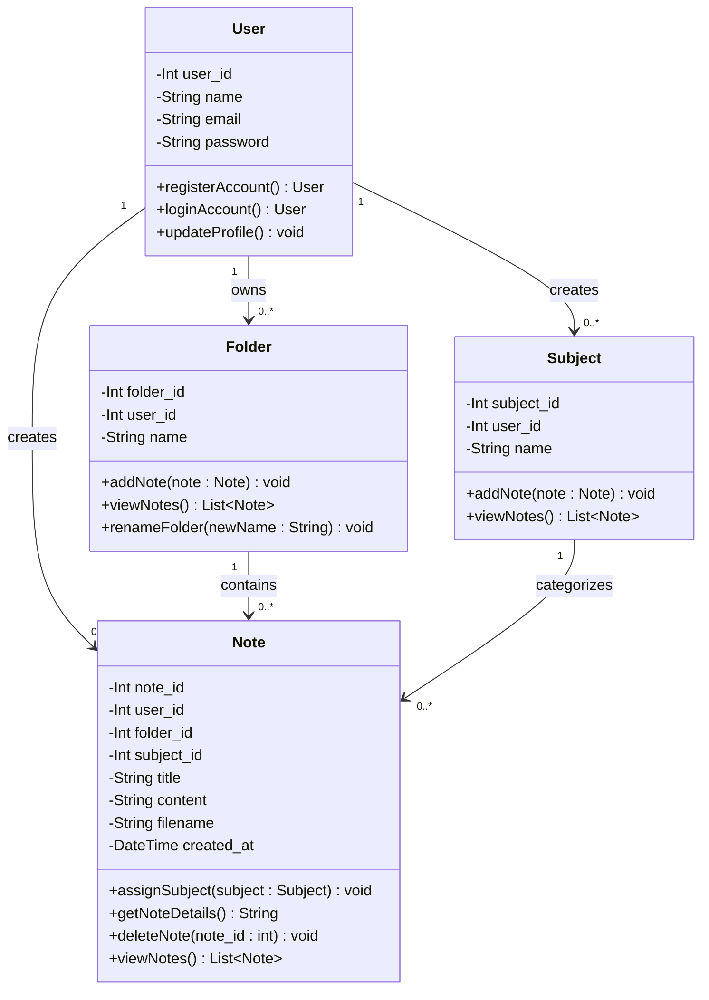

# NoteTect - Entity Relationship Diagram (ERD)

## Overview

This ERD represents the database structure for NoteTect, an AI-powered note-taking application designed to manage users, folders, subjects, and generated notes.

## Entities and Attributes

### 1. User

**Primary Key:** user_id

- user_id (PK) - INT, AUTO_INCREMENT
- name - VARCHAR(255), NOT NULL
- email - VARCHAR(255), UNIQUE, NOT NULL
- password - VARCHAR(255), NOT NULL

### 2. Folder

**Primary Key:** id

- id (PK) - INT, AUTO_INCREMENT
- name - VARCHAR(255), NOT NULL
- user_id (FK) - INT, NOT NULL

### 3. Subject

**Primary Key:** id

- id (PK) - INT, AUTO_INCREMENT
- name - VARCHAR(255), NOT NULL
- user_id (FK) - INT, NOT NULL

### 4. Note

**Primary Key:** id

- id (PK) - INT, AUTO_INCREMENT
- content - TEXT
- filename - VARCHAR(255)
- created_at - VARCHAR(255)
- folder_id (FK) - INT
- subject_id (FK) - INT
- user_id (FK) - INT, NOT NULL

## Relationships

### One-to-Many Relationships:

1.  **User → Folder** (1:N)
    - One user can create many folders
    - Foreign Key: folder.user_id → user.user_id

2.  **User → Subject** (1:N)
    - One user can create many subjects
    - Foreign Key: subject.user_id → user.user_id

3.  **User → Note** (1:N)
    - One user can create many notes
    - Foreign Key: note.user_id → user.user_id

4.  **Folder → Note** (1:N)
    - One folder can contain many notes
    - Foreign Key: note.folder_id → folder.id

5.  **Subject → Note** (1:N)
    - One subject can categorize many notes
    - Foreign Key: note.subject_id → subject.id

## Business Rules and Constraints

1.  **Ownership Rules:**
    - Users can only access their own notes, folders, and subjects.
    - Data is isolated per user (Multi-tenancy by column).

2.  **Organization Rules:**
    - A note can belong to one folder.
    - A note can be assigned to one subject.
    - Deleting a folder or subject may cascade delete associated notes (based on `CascadeType.ALL` in code).

3.  **User Rules:**
    - Users must have a unique email address.fhh

## Visual Representation

## Class Diagram || UML Diagram

